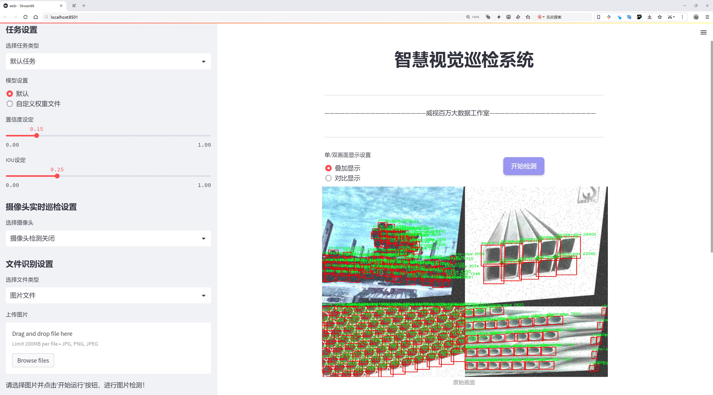
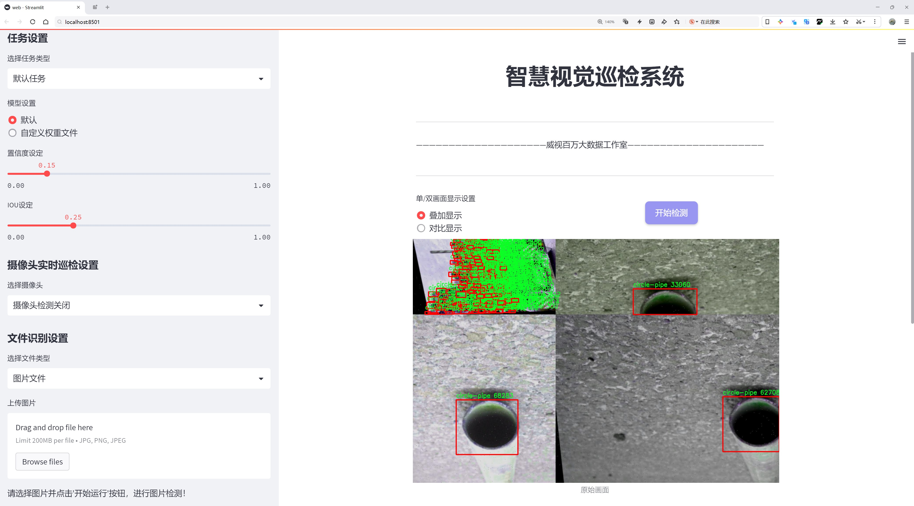
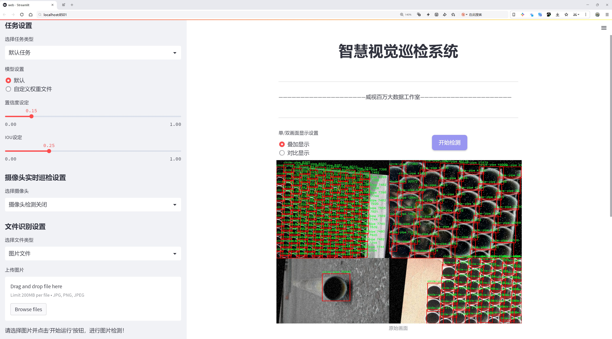
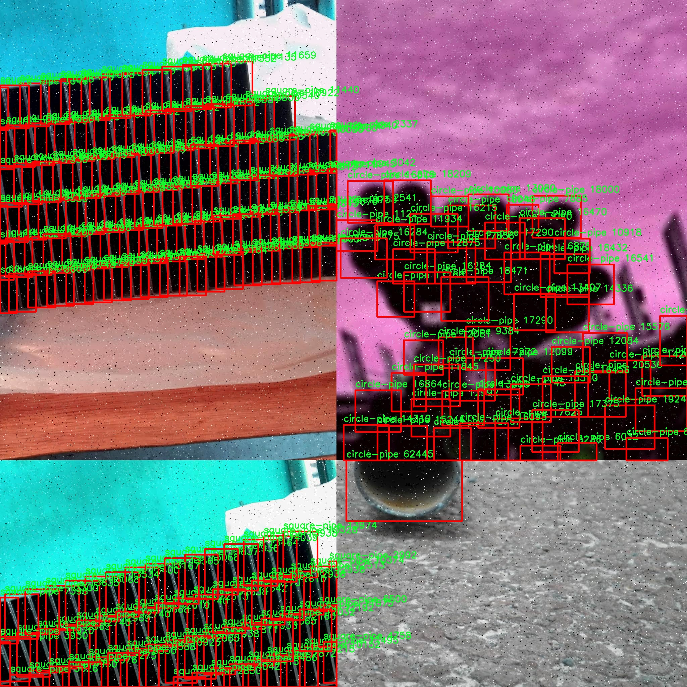
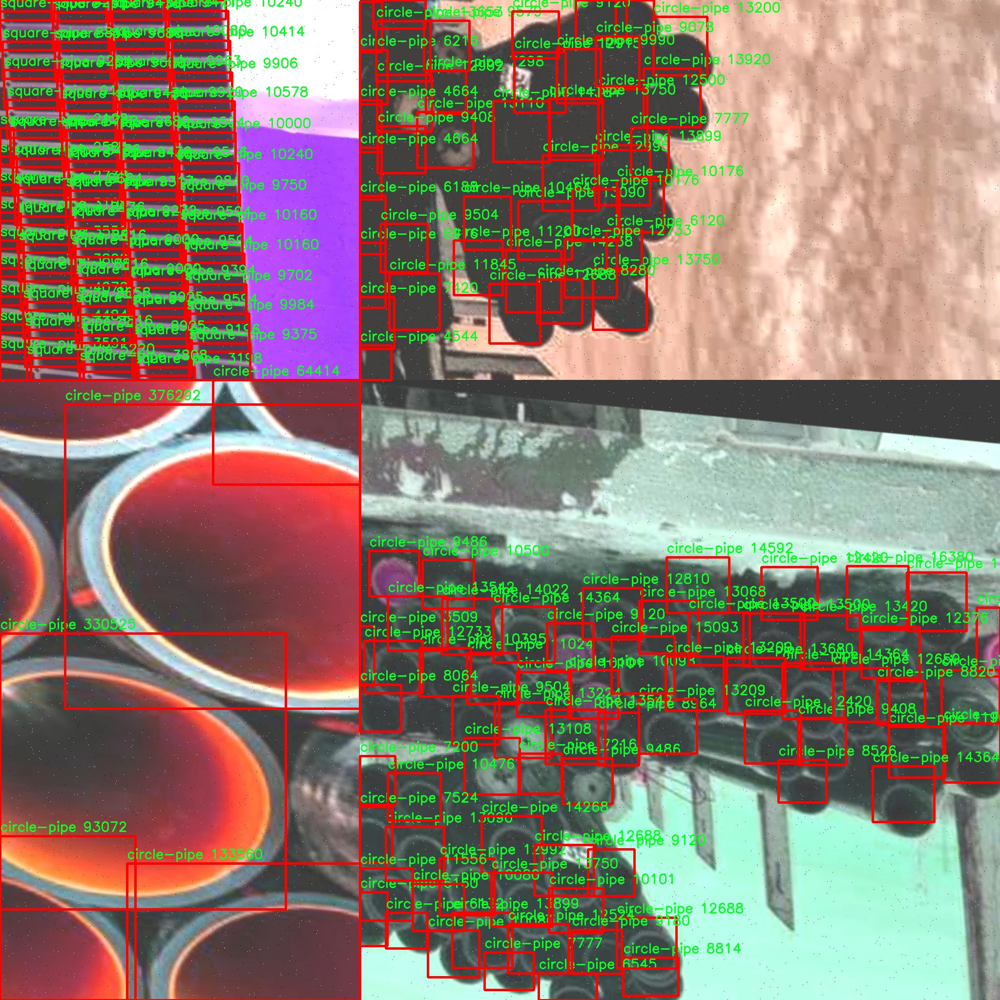
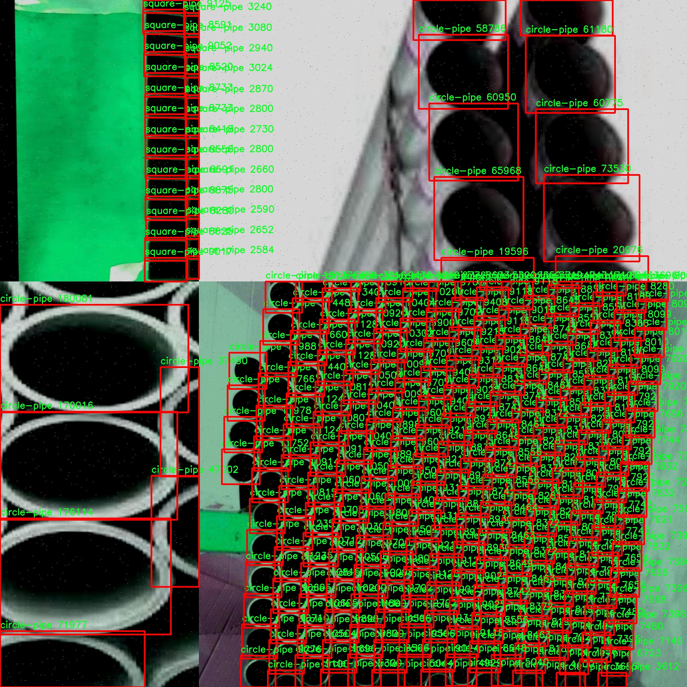
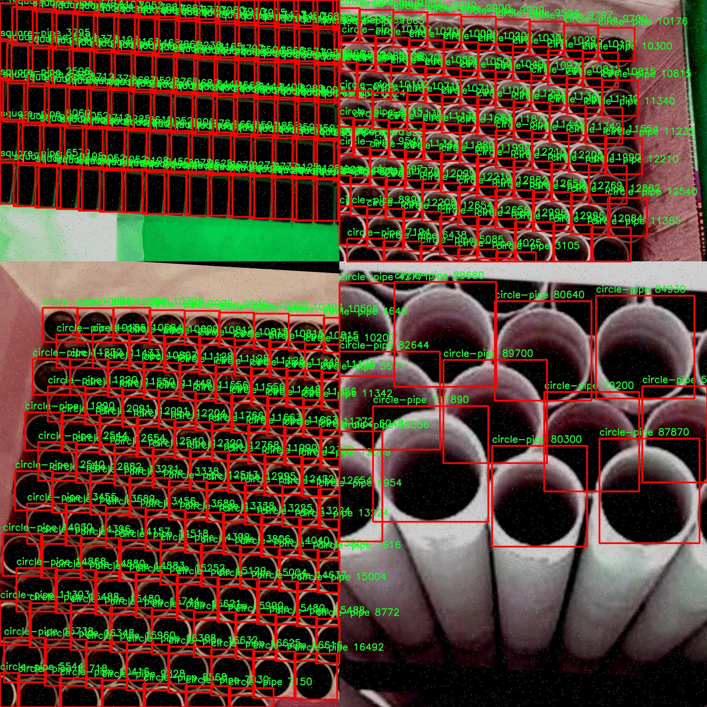
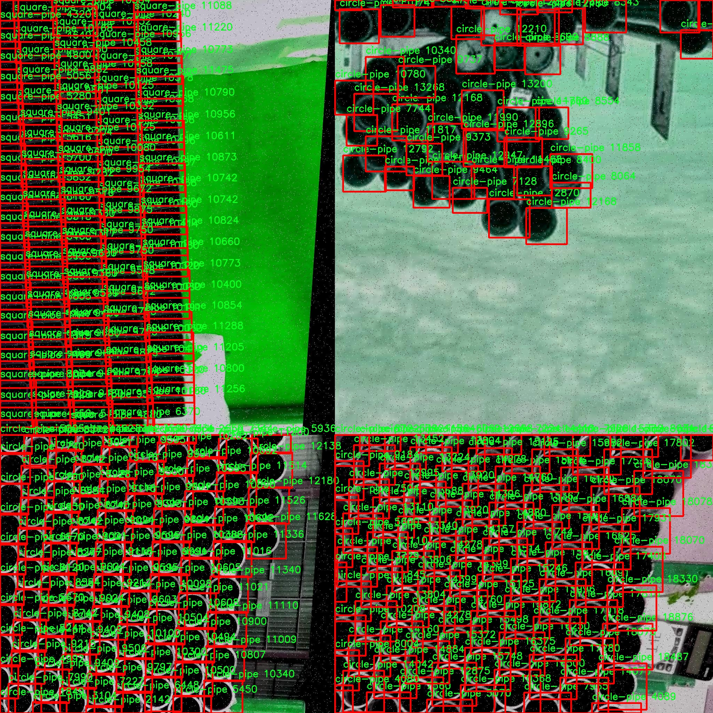

# 管道缺陷检测检测系统源码分享
 # [一条龙教学YOLOV8标注好的数据集一键训练_70+全套改进创新点发刊_Web前端展示]

### 1.研究背景与意义

项目参考[AAAI Association for the Advancement of Artificial Intelligence](https://gitee.com/qunmasj/projects)

项目来源[AACV Association for the Advancement of Computer Vision](https://kdocs.cn/l/cszuIiCKVNis)

研究背景与意义

随着城市化进程的加快，地下管道系统的建设与维护变得愈发重要。管道作为城市基础设施的重要组成部分，其安全性和可靠性直接影响到城市的正常运行和居民的生活质量。然而，管道在长期使用过程中，容易受到腐蚀、沉降、堵塞等多种因素的影响，导致各种缺陷的产生。这些缺陷不仅会造成资源的浪费，还可能引发严重的安全事故。因此，及时、准确地检测管道缺陷，成为了保障城市安全与可持续发展的重要任务。

传统的管道检测方法多依赖人工巡检和传统的检测设备，这不仅耗时耗力，而且在检测精度和效率上存在诸多不足。近年来，随着计算机视觉和深度学习技术的快速发展，基于图像处理的自动化检测方法逐渐成为研究热点。YOLO（You Only Look Once）系列目标检测算法因其高效性和实时性，广泛应用于各类物体检测任务中。特别是YOLOv8，作为该系列的最新版本，具备了更强的特征提取能力和更高的检测精度，能够有效应对复杂环境下的目标检测问题。

本研究旨在基于改进的YOLOv8算法，构建一个高效的管道缺陷检测系统。我们将利用包含1800张图像的p15-pipe数据集，该数据集涵盖了五类管道缺陷，包括不同类型的缺陷标记（如0、1、2、BKN-4和circle-pipe）。通过对这些数据的深入分析与处理，我们可以为模型的训练提供丰富的样本，从而提高检测的准确性和鲁棒性。数据集的多样性使得模型能够在不同的管道环境和缺陷类型下进行有效的学习与适应，进一步提升了系统的实用性。

在研究意义上，基于改进YOLOv8的管道缺陷检测系统不仅能够显著提高管道检测的效率和准确性，还能够为城市基础设施的维护提供重要的技术支持。通过自动化的检测手段，减少人工干预的需求，降低了人力成本和潜在的安全风险。此外，该系统的成功应用还将为其他领域的目标检测提供借鉴，推动计算机视觉技术在更多实际场景中的应用。

综上所述，基于改进YOLOv8的管道缺陷检测系统的研究，不仅具有重要的理论价值，也具备广泛的应用前景。通过深入探索和优化这一技术，我们期望能够为城市管道的安全管理提供创新的解决方案，促进智慧城市的发展。

### 2.图片演示







##### 注意：由于此博客编辑较早，上面“2.图片演示”和“3.视频演示”展示的系统图片或者视频可能为老版本，新版本在老版本的基础上升级如下：（实际效果以升级的新版本为准）

  （1）适配了YOLOV8的“目标检测”模型和“实例分割”模型，通过加载相应的权重（.pt）文件即可自适应加载模型。

  （2）支持“图片识别”、“视频识别”、“摄像头实时识别”三种识别模式。

  （3）支持“图片识别”、“视频识别”、“摄像头实时识别”三种识别结果保存导出，解决手动导出（容易卡顿出现爆内存）存在的问题，识别完自动保存结果并导出到tempDir中。

  （4）支持Web前端系统中的标题、背景图等自定义修改，后面提供修改教程。

  另外本项目提供训练的数据集和训练教程,暂不提供权重文件（best.pt）,需要您按照教程进行训练后实现图片演示和Web前端界面演示的效果。

### 3.视频演示

[3.1 视频演示](https://www.bilibili.com/video/BV1D9sSejEgk/)

### 4.数据集信息展示

##### 4.1 本项目数据集详细数据（类别数＆类别名）

nc: 3
names: ['circle-pipe', 'side-pipe', 'square-pipe']


##### 4.2 本项目数据集信息介绍

数据集信息展示

在管道缺陷检测领域，数据集的质量和多样性直接影响到模型的训练效果和实际应用的准确性。本研究所采用的数据集名为“p15-pipe”，该数据集专门为改进YOLOv8的管道缺陷检测系统而设计，旨在提升模型在不同管道形状下的检测能力和准确率。数据集包含三种主要类别，分别为“circle-pipe”（圆形管道）、“side-pipe”（侧面管道）和“square-pipe”（方形管道），这些类别的选择充分考虑了实际应用中管道的多样性和复杂性。

“p15-pipe”数据集的构建过程经过精心设计，确保每一类管道的样本都具备代表性和多样性。圆形管道作为最常见的管道类型，其样本涵盖了不同直径、材质和表面状况的管道图像，确保模型能够在各种情况下有效识别。侧面管道则主要用于模拟管道在特定角度下的缺陷表现，这一类别的样本包括了管道的不同侧面视角，旨在提高模型对管道侧面缺陷的敏感性。方形管道样本则相对较少，但其在特定工业应用中的重要性不容忽视，因此数据集中包含了多种方形管道的图像，以确保模型在处理这类管道时的准确性。

数据集的构建不仅关注图像的数量，还注重图像的质量和标注的准确性。所有样本均经过专业人员的严格标注，确保每个缺陷的类型和位置都得到了准确的识别和记录。这种高质量的标注为后续的模型训练提供了坚实的基础，使得YOLOv8能够在学习过程中更好地理解和识别不同类型的管道缺陷。

在数据集的预处理阶段，采用了多种数据增强技术，如旋转、缩放、翻转等，以增加数据的多样性和丰富性。这些增强措施不仅提高了模型的鲁棒性，还能有效防止过拟合现象的发生，使得模型在面对未知数据时能够保持良好的性能。此外，数据集还考虑到了不同光照条件和背景环境的影响，确保模型在实际应用中能够适应各种复杂场景。

通过对“p15-pipe”数据集的深入分析和研究，预期能够显著提升YOLOv8在管道缺陷检测任务中的表现。该数据集的多样性和高质量标注将为模型提供丰富的学习素材，使其在处理不同形状和状态的管道时，能够更快速、更准确地识别出潜在的缺陷。这不仅有助于提高管道检测的效率，也为后续的管道维护和管理提供了重要的数据支持。

总之，“p15-pipe”数据集在管道缺陷检测领域具有重要的应用价值和研究意义，其丰富的类别和高质量的样本为改进YOLOv8模型提供了强有力的支持。通过对该数据集的有效利用，期望能够推动管道检测技术的发展，为工业安全和环境保护贡献一份力量。











### 5.全套项目环境部署视频教程（零基础手把手教学）

[5.1 环境部署教程链接（零基础手把手教学）](https://www.ixigua.com/7404473917358506534?logTag=c807d0cbc21c0ef59de5)


[5.2 安装Python虚拟环境创建和依赖库安装视频教程链接（零基础手把手教学）](https://www.ixigua.com/7404474678003106304?logTag=1f1041108cd1f708b01a)

### 6.手把手YOLOV8训练视频教程（零基础小白有手就能学会）

[6.1 手把手YOLOV8训练视频教程（零基础小白有手就能学会）](https://www.ixigua.com/7404477157818401292?logTag=d31a2dfd1983c9668658)

### 7.70+种全套YOLOV8创新点代码加载调参视频教程（一键加载写好的改进模型的配置文件）

[7.1 70+种全套YOLOV8创新点代码加载调参视频教程（一键加载写好的改进模型的配置文件）](https://www.ixigua.com/7404478314661806627?logTag=29066f8288e3f4eea3a4)

### 8.70+种全套YOLOV8创新点原理讲解（非科班也可以轻松写刊发刊，V10版本正在科研待更新）

由于篇幅限制，每个创新点的具体原理讲解就不一一展开，具体见下列网址中的创新点对应子项目的技术原理博客网址【Blog】：


[8.1 70+种全套YOLOV8创新点原理讲解链接](https://gitee.com/qunmasj/good)

### 9.系统功能展示（检测对象为举例，实际内容以本项目数据集为准）

图9.1.系统支持检测结果表格显示

  图9.2.系统支持置信度和IOU阈值手动调节

  图9.3.系统支持自定义加载权重文件best.pt(需要你通过步骤5中训练获得)

  图9.4.系统支持摄像头实时识别

  图9.5.系统支持图片识别

  图9.6.系统支持视频识别

  图9.7.系统支持识别结果文件自动保存

  图9.8.系统支持Excel导出检测结果数据


### 10.原始YOLOV8算法原理

原始YOLOv8算法原理

YOLOv8作为YOLO系列模型的最新版本，于2023年1月10日正式推出，标志着计算机视觉领域在目标检测、分类和分割任务中的又一次重大进步。它不仅在精度和执行时间上超越了所有已知模型，还在模型设计上吸取了YOLOv5、YOLOv6和YOLOX等前辈的优点，进一步提升了YOLOv5的基础结构，保持了其工程化的简洁性和易用性。

YOLOv8的核心在于其创新的网络结构和高效的处理机制。首先，YOLOv8采用了新的骨干网络，取代了YOLOv5中的C3模块，使用了C2f模块。这一变化不仅丰富了网络的特征提取能力，还通过增加更多的跳层连接和Split操作，优化了梯度的流动，使得深层网络中的梯度消失问题得到了有效缓解。C2f模块的设计灵感来源于YOLOv7的ELAN思想，允许模型在训练过程中更好地重用浅层特征，从而提高了模型的整体性能。

在特征融合方面，YOLOv8继续采用了FPN（特征金字塔网络）和PAN（路径聚合网络）的结合，形成了一个强大的特征融合层。这一结构能够有效地将多尺度信息进行整合，使得模型在处理不同大小的目标时都能保持较高的准确性。YOLOv8在这一部分的创新在于将C3模块替换为C2f模块，从而增强了特征融合的能力，使得高层语义信息与低层细节信息能够更好地结合。

YOLOv8在检测头的设计上也进行了重要的创新。传统的YOLO系列模型一直采用耦合头，即通过一层卷积同时完成分类和定位任务。而YOLOv8则引入了解耦头的概念，将分类和定位任务分开处理。这一结构使得模型在分类和回归的任务上能够独立优化，进而提高了检测的精度和效率。YOLOv8的解耦头结构包括两个并行的分支，分别负责提取类别特征和位置特征，利用1×1卷积层分别完成分类和定位任务。

在损失函数的设计上，YOLOv8采用了新的标签分配策略和损失计算方法。与YOLOv5依赖于静态聚类候选框的方式不同，YOLOv8引入了动态标签分配策略，确保在不同的训练阶段，模型能够更好地适应数据集的特征。这一策略的核心在于使用Varifocal Loss（VFLoss）作为分类损失，并结合CIoULoss和DFLLoss来计算回归损失。VFLoss通过对正负样本进行不对称加权，使得模型在训练时能够更关注高质量的正样本，从而提升了整体的检测性能。

YOLOv8的设计还特别考虑了小目标检测和高分辨率图像的处理能力，这使得其在实际应用中表现出色。通过对网络结构的优化，YOLOv8能够在各种硬件平台上高效运行，从CPU到GPU的不同环境下均能保持良好的性能。此外，YOLOv8在数据预处理上延续了YOLOv5的策略，采用了马赛克增强、混合增强、空间扰动和颜色扰动等多种数据增强手段，以提高模型的鲁棒性和泛化能力。

在整体架构上，YOLOv8的输入层、主干网络、特征融合层和解耦头共同构成了一个高效的目标检测系统。输入层负责将图像数据转换为适合模型处理的格式，主干网络则通过一系列卷积层和特征提取模块提取出图像中的重要特征。特征融合层通过FPN和PAN结构将不同层次的特征进行整合，确保模型能够充分利用多尺度信息。而解耦头则将最终的特征图转换为检测结果，输出分类和回归信息。

总的来说，YOLOv8通过对模型结构的深度优化和创新，显著提升了目标检测的精度和速度，成为当前计算机视觉领域中最先进的模型之一。其在小目标检测、高分辨率图像处理以及实时目标检测中的表现，充分展现了YOLO系列模型在技术演进中的不断突破和进步。随着YOLOv8的推出，目标检测技术将迎来新的发展机遇，为实际应用提供更为强大的支持。


### 11.项目核心源码讲解（再也不用担心看不懂代码逻辑）

#### 11.1 ui.py

以下是经过精简和注释的核心代码部分：

```python
import sys
import subprocess
from QtFusion.path import abs_path

def run_script(script_path):
    """
    使用当前 Python 环境运行指定的脚本。

    Args:
        script_path (str): 要运行的脚本路径
    """
    # 获取当前 Python 解释器的路径
    python_path = sys.executable

    # 构建运行命令，使用 streamlit 运行指定的脚本
    command = f'"{python_path}" -m streamlit run "{script_path}"'

    # 执行命令，并检查返回结果
    result = subprocess.run(command, shell=True)
    if result.returncode != 0:
        print("脚本运行出错。")

# 主程序入口
if __name__ == "__main__":
    # 获取脚本的绝对路径
    script_path = abs_path("web.py")

    # 运行指定的脚本
    run_script(script_path)
```

### 代码详细注释：
1. **导入模块**：
   - `sys`：用于访问与 Python 解释器相关的变量和函数。
   - `subprocess`：用于执行外部命令。
   - `abs_path`：从 `QtFusion.path` 模块导入的函数，用于获取文件的绝对路径。

2. **`run_script` 函数**：
   - 定义一个函数，接受一个参数 `script_path`，表示要运行的脚本的路径。
   - 使用 `sys.executable` 获取当前 Python 解释器的路径。
   - 构建一个命令字符串，使用 `streamlit` 模块运行指定的脚本。
   - 使用 `subprocess.run` 执行命令，并通过 `shell=True` 允许在 shell 中执行命令。
   - 检查命令的返回码，如果不为 0，表示脚本运行出错，打印错误信息。

3. **主程序入口**：
   - 使用 `if __name__ == "__main__":` 确保代码只在直接运行时执行。
   - 调用 `abs_path` 函数获取 `web.py` 脚本的绝对路径。
   - 调用 `run_script` 函数运行指定的脚本。

这个程序文件 `ui.py` 是一个用于运行指定 Python 脚本的简单工具，特别是用来启动一个基于 Streamlit 的 Web 应用。首先，文件导入了必要的模块，包括 `sys`、`os` 和 `subprocess`，这些模块提供了与系统交互的功能。

在文件中定义了一个名为 `run_script` 的函数，该函数接受一个参数 `script_path`，表示要运行的脚本的路径。函数的主要功能是使用当前的 Python 环境来执行指定的脚本。首先，它通过 `sys.executable` 获取当前 Python 解释器的路径。接着，构建一个命令字符串，该命令使用 `streamlit run` 来运行指定的脚本。这里使用了 `subprocess.run` 来执行这个命令，`shell=True` 参数允许在 shell 中执行命令。

在执行命令后，函数检查返回的结果代码。如果返回代码不为零，表示脚本运行出错，程序会打印出相应的错误信息。

在文件的最后部分，使用 `if __name__ == "__main__":` 语句来确保当该文件作为主程序运行时才会执行后面的代码。此时，指定了要运行的脚本路径，这里使用了 `abs_path` 函数来获取 `web.py` 的绝对路径。最后，调用 `run_script` 函数来执行这个脚本。

总的来说，这个程序的主要功能是通过当前的 Python 环境启动一个 Streamlit 应用，提供了一种简单的方式来运行 Web 应用脚本。

#### 11.2 70+种YOLOv8算法改进源码大全和调试加载训练教程（非必要）\ultralytics\models\fastsam\model.py

```python
# 导入所需的库
from pathlib import Path
from ultralytics.engine.model import Model
from .predict import FastSAMPredictor
from .val import FastSAMValidator

class FastSAM(Model):
    """
    FastSAM模型接口。

    示例用法：
        ```python
        from ultralytics import FastSAM

        model = FastSAM('last.pt')  # 加载模型
        results = model.predict('ultralytics/assets/bus.jpg')  # 进行预测
        ```
    """

    def __init__(self, model='FastSAM-x.pt'):
        """初始化FastSAM类，调用父类（YOLO）的__init__方法，并设置默认模型。"""
        # 如果传入的模型名是'FastSAM.pt'，则使用'FastSAM-x.pt'作为默认模型
        if str(model) == 'FastSAM.pt':
            model = 'FastSAM-x.pt'
        # 确保模型文件的后缀不是.yaml或.yml，FastSAM模型只支持预训练模型
        assert Path(model).suffix not in ('.yaml', '.yml'), 'FastSAM models only support pre-trained models.'
        # 调用父类的初始化方法，设置模型和任务类型为'segment'
        super().__init__(model=model, task='segment')

    @property
    def task_map(self):
        """返回一个字典，将分割任务映射到相应的预测器和验证器类。"""
        return {'segment': {'predictor': FastSAMPredictor, 'validator': FastSAMValidator}}
```

### 代码核心部分及注释说明：

1. **导入模块**：
   - `from pathlib import Path`：用于处理文件路径。
   - `from ultralytics.engine.model import Model`：导入YOLO模型的基类。
   - `from .predict import FastSAMPredictor`：导入FastSAM的预测器类。
   - `from .val import FastSAMValidator`：导入FastSAM的验证器类。

2. **FastSAM类**：
   - 继承自`Model`类，表示FastSAM模型的接口。

3. **构造函数`__init__`**：
   - 设定默认模型为`FastSAM-x.pt`，如果传入`FastSAM.pt`，则替换为`FastSAM-x.pt`。
   - 使用`assert`语句确保传入的模型文件后缀不是`.yaml`或`.yml`，以保证只使用预训练模型。
   - 调用父类的构造函数，传入模型路径和任务类型（分割任务）。

4. **属性`task_map`**：
   - 返回一个字典，映射分割任务到相应的预测器和验证器类，便于后续的任务处理。

这个程序文件是一个关于FastSAM模型的实现，属于Ultralytics YOLO系列的一个扩展。文件中定义了一个名为`FastSAM`的类，该类继承自`Model`类，主要用于处理图像分割任务。

在类的文档字符串中，提供了一个简单的使用示例，展示了如何导入`FastSAM`类并加载一个预训练模型（`last.pt`），然后对一张图片（`bus.jpg`）进行预测。这为用户提供了一个直观的使用方式。

构造函数`__init__`接受一个模型文件名作为参数，默认值为`FastSAM-x.pt`。在构造函数中，如果传入的模型名称是`FastSAM.pt`，则将其更改为`FastSAM-x.pt`。接着，代码使用`assert`语句确保传入的模型文件名后缀不是`.yaml`或`.yml`，因为FastSAM模型只支持预训练模型。最后，调用父类的构造函数，初始化模型并指定任务类型为`segment`，表示这是一个分割任务。

`task_map`属性返回一个字典，该字典将分割任务映射到相应的预测器和验证器类。具体来说，`segment`任务对应的预测器是`FastSAMPredictor`，验证器是`FastSAMValidator`。这使得在执行分割任务时，可以方便地调用相应的类来进行预测和验证。

整体来看，这段代码为FastSAM模型的使用提供了一个清晰的接口，便于用户进行图像分割任务的实现。

#### 11.3 code\ultralytics\__init__.py

以下是保留的核心代码部分，并附上详细的中文注释：

```python
# 导入所需的库和模块
from ultralytics.models import YOLO  # 导入YOLO模型
from ultralytics.utils import SETTINGS as settings  # 导入设置配置
from ultralytics.utils.checks import check_yolo as checks  # 导入YOLO检查工具
from ultralytics.utils.downloads import download  # 导入下载工具

# 定义可导出的模块内容
__all__ = "__version__", "YOLO", "checks", "download", "settings"
```

### 代码注释说明：

1. **导入库和模块**：
   - `from ultralytics.models import YOLO`：导入YOLO模型，这是一个用于目标检测的深度学习模型。
   - `from ultralytics.utils import SETTINGS as settings`：导入设置配置，通常包含模型的超参数和其他配置信息。
   - `from ultralytics.utils.checks import check_yolo as checks`：导入YOLO检查工具，用于验证YOLO模型的有效性和正确性。
   - `from ultralytics.utils.downloads import download`：导入下载工具，用于下载模型权重或其他资源。

2. **定义可导出的模块内容**：
   - `__all__` 是一个特殊变量，用于定义当使用 `from module import *` 时，哪些名称是可以被导出的。在这里，导出了版本号、YOLO模型、检查工具、下载工具和设置配置。

通过以上核心部分和注释，可以清晰地理解代码的主要功能和结构。

这个程序文件是Ultralytics YOLO库的初始化文件，文件名为`__init__.py`，用于定义该模块的基本信息和导入必要的组件。首先，文件中定义了库的版本号为“8.1.3”，这有助于用户和开发者了解当前使用的库版本。

接下来，文件从不同的子模块中导入了多个类和函数。具体来说，它导入了`Explorer`类，这可能是一个用于数据探索和可视化的工具；`RTDETR`、`SAM`、`YOLO`和`FastSAM`等模型类，这些都是与目标检测和分割相关的模型，提供了不同的算法和功能；`NAS`类可能与神经架构搜索相关，帮助优化模型结构。

此外，文件还导入了一些实用工具，包括`SETTINGS`，这可能包含库的配置设置；`check_yolo`函数用于检查YOLO模型的有效性；`download`函数则可能用于下载模型或数据集等资源。

最后，`__all__`变量定义了模块的公共接口，列出了可以被外部导入的名称。这包括版本号、各个模型类、检查函数、下载函数、设置和数据探索工具。通过这种方式，用户可以方便地访问这些功能，而不需要了解模块内部的实现细节。整体来看，这个文件的结构清晰，功能明确，为使用Ultralytics YOLO库提供了良好的基础。

#### 11.4 train.py

以下是经过简化和注释的核心代码部分：

```python
import random
import numpy as np
import torch.nn as nn
from ultralytics.data import build_dataloader, build_yolo_dataset
from ultralytics.engine.trainer import BaseTrainer
from ultralytics.models import yolo
from ultralytics.nn.tasks import DetectionModel
from ultralytics.utils import LOGGER, RANK
from ultralytics.utils.torch_utils import de_parallel, torch_distributed_zero_first

class DetectionTrainer(BaseTrainer):
    """
    基于检测模型的训练类，继承自BaseTrainer类。
    """

    def build_dataset(self, img_path, mode="train", batch=None):
        """
        构建YOLO数据集。

        参数:
            img_path (str): 包含图像的文件夹路径。
            mode (str): 模式，`train`表示训练模式，`val`表示验证模式。
            batch (int, optional): 批次大小，仅用于`rect`模式。默认为None。
        """
        gs = max(int(de_parallel(self.model).stride.max() if self.model else 0), 32)  # 获取模型的最大步幅
        return build_yolo_dataset(self.args, img_path, batch, self.data, mode=mode, rect=mode == "val", stride=gs)

    def get_dataloader(self, dataset_path, batch_size=16, rank=0, mode="train"):
        """构造并返回数据加载器。"""
        assert mode in ["train", "val"]  # 确保模式有效
        with torch_distributed_zero_first(rank):  # 在分布式环境中只初始化一次数据集
            dataset = self.build_dataset(dataset_path, mode, batch_size)
        shuffle = mode == "train"  # 训练模式下打乱数据
        workers = self.args.workers if mode == "train" else self.args.workers * 2  # 设置工作线程数
        return build_dataloader(dataset, batch_size, workers, shuffle, rank)  # 返回数据加载器

    def preprocess_batch(self, batch):
        """对图像批次进行预处理，包括缩放和转换为浮点数。"""
        batch["img"] = batch["img"].to(self.device, non_blocking=True).float() / 255  # 转换为浮点数并归一化
        if self.args.multi_scale:  # 如果启用多尺度
            imgs = batch["img"]
            sz = (
                random.randrange(self.args.imgsz * 0.5, self.args.imgsz * 1.5 + self.stride)
                // self.stride
                * self.stride
            )  # 随机选择新的尺寸
            sf = sz / max(imgs.shape[2:])  # 计算缩放因子
            if sf != 1:
                ns = [
                    math.ceil(x * sf / self.stride) * self.stride for x in imgs.shape[2:]
                ]  # 计算新的形状
                imgs = nn.functional.interpolate(imgs, size=ns, mode="bilinear", align_corners=False)  # 进行插值
            batch["img"] = imgs
        return batch

    def get_model(self, cfg=None, weights=None, verbose=True):
        """返回YOLO检测模型。"""
        model = DetectionModel(cfg, nc=self.data["nc"], verbose=verbose and RANK == -1)  # 创建检测模型
        if weights:
            model.load(weights)  # 加载权重
        return model

    def plot_training_samples(self, batch, ni):
        """绘制带有注释的训练样本。"""
        plot_images(
            images=batch["img"],
            batch_idx=batch["batch_idx"],
            cls=batch["cls"].squeeze(-1),
            bboxes=batch["bboxes"],
            paths=batch["im_file"],
            fname=self.save_dir / f"train_batch{ni}.jpg",
            on_plot=self.on_plot,
        )

    def plot_metrics(self):
        """从CSV文件中绘制指标。"""
        plot_results(file=self.csv, on_plot=self.on_plot)  # 保存结果图
```

### 代码注释说明：
1. **类定义**：`DetectionTrainer`类是用于训练YOLO检测模型的主要类，继承自`BaseTrainer`。
2. **构建数据集**：`build_dataset`方法用于构建YOLO数据集，支持训练和验证模式。
3. **获取数据加载器**：`get_dataloader`方法根据指定的模式和批次大小构建数据加载器。
4. **预处理批次**：`preprocess_batch`方法对输入图像进行归一化和可能的缩放处理。
5. **获取模型**：`get_model`方法返回一个YOLO检测模型，并可选择加载预训练权重。
6. **绘制训练样本**：`plot_training_samples`方法用于可视化训练样本及其标注。
7. **绘制指标**：`plot_metrics`方法用于从CSV文件中绘制训练过程中的指标。

这个程序文件 `train.py` 是一个用于训练目标检测模型的代码，主要基于 YOLO（You Only Look Once）架构。代码中定义了一个名为 `DetectionTrainer` 的类，该类继承自 `BaseTrainer`，用于实现训练过程中的各种功能。

在类的定义中，首先导入了一些必要的库和模块，包括数学运算、随机数生成、深度学习相关的 PyTorch 库以及 Ultralytics 提供的 YOLO 相关模块。类的文档字符串中给出了使用示例，展示了如何创建 `DetectionTrainer` 实例并调用 `train` 方法进行训练。

`DetectionTrainer` 类包含多个方法，首先是 `build_dataset` 方法，用于构建 YOLO 数据集。该方法接收图像路径、模式（训练或验证）和批次大小作为参数，使用 `build_yolo_dataset` 函数生成数据集。接着是 `get_dataloader` 方法，该方法构建并返回数据加载器，确保在分布式训练时只初始化一次数据集。

`preprocess_batch` 方法用于对图像批次进行预处理，包括缩放和转换为浮点数格式。此方法还支持多尺度训练，通过随机选择图像大小来增强模型的鲁棒性。`set_model_attributes` 方法则用于设置模型的属性，包括类别数量和类别名称等。

`get_model` 方法返回一个 YOLO 检测模型，并可选择加载预训练权重。`get_validator` 方法返回一个用于模型验证的 `DetectionValidator` 实例，便于在训练过程中进行模型性能评估。

`label_loss_items` 方法用于返回带有标签的训练损失项字典，方便监控训练过程中的损失变化。`progress_string` 方法生成一个格式化的字符串，用于显示训练进度，包括当前的 epoch、GPU 内存使用情况、损失值、实例数量和图像大小等信息。

此外，`plot_training_samples` 方法用于绘制训练样本及其标注，便于可视化训练数据的质量。`plot_metrics` 方法从 CSV 文件中绘制训练指标，生成结果图表。最后，`plot_training_labels` 方法创建一个带标签的训练图，展示训练数据中的边界框和类别信息。

整体来看，这个文件实现了 YOLO 模型训练的核心功能，涵盖了数据集构建、数据加载、模型训练、损失监控和结果可视化等多个方面，为用户提供了一个完整的训练框架。

#### 11.5 70+种YOLOv8算法改进源码大全和调试加载训练教程（非必要）\ultralytics\models\utils\loss.py

以下是经过简化和注释的核心代码部分，主要保留了损失计算的关键功能，并对每个部分进行了详细的中文注释：

```python
import torch
import torch.nn as nn
import torch.nn.functional as F
from ultralytics.utils.metrics import bbox_iou
from .ops import HungarianMatcher

class DETRLoss(nn.Module):
    """
    DETR (DEtection TRansformer) 损失类。该类计算并返回DETR目标检测模型的不同损失组件。
    包括分类损失、边界框损失、GIoU损失等。
    """

    def __init__(self, nc=80, loss_gain=None, aux_loss=True):
        """
        初始化DETR损失函数。

        Args:
            nc (int): 类别数量。
            loss_gain (dict): 各种损失组件的系数。
            aux_loss (bool): 是否计算辅助损失。
        """
        super().__init__()
        if loss_gain is None:
            loss_gain = {'class': 1, 'bbox': 5, 'giou': 2}
        self.nc = nc  # 类别数量
        self.loss_gain = loss_gain  # 损失系数
        self.aux_loss = aux_loss  # 是否使用辅助损失
        self.matcher = HungarianMatcher(cost_gain={'class': 2, 'bbox': 5, 'giou': 2})  # 匹配器

    def _get_loss_class(self, pred_scores, targets, gt_scores, num_gts):
        """计算分类损失。"""
        bs, nq = pred_scores.shape[:2]  # 获取批次大小和查询数量
        one_hot = torch.zeros((bs, nq, self.nc + 1), dtype=torch.int64, device=targets.device)
        one_hot.scatter_(2, targets.unsqueeze(-1), 1)  # 创建one-hot编码
        one_hot = one_hot[..., :-1]  # 去掉最后一类（背景类）
        gt_scores = gt_scores.view(bs, nq, 1) * one_hot  # 计算真实分数

        # 使用BCE损失计算分类损失
        loss_cls = nn.BCEWithLogitsLoss(reduction='none')(pred_scores, gt_scores).mean(1).sum()
        loss_cls /= max(num_gts, 1) / nq  # 归一化损失
        return {'loss_class': loss_cls * self.loss_gain['class']}  # 返回损失

    def _get_loss_bbox(self, pred_bboxes, gt_bboxes):
        """计算边界框损失和GIoU损失。"""
        loss = {}
        if len(gt_bboxes) == 0:  # 如果没有真实边界框
            loss['loss_bbox'] = torch.tensor(0., device=self.device)
            loss['loss_giou'] = torch.tensor(0., device=self.device)
            return loss

        # 计算L1损失
        loss['loss_bbox'] = self.loss_gain['bbox'] * F.l1_loss(pred_bboxes, gt_bboxes, reduction='sum') / len(gt_bboxes)
        # 计算GIoU损失
        loss['loss_giou'] = 1.0 - bbox_iou(pred_bboxes, gt_bboxes, xywh=True, GIoU=True)
        loss['loss_giou'] = loss['loss_giou'].sum() / len(gt_bboxes) * self.loss_gain['giou']
        return loss  # 返回损失

    def _get_loss(self, pred_bboxes, pred_scores, gt_bboxes, gt_cls):
        """计算总损失。"""
        match_indices = self.matcher(pred_bboxes, pred_scores, gt_bboxes, gt_cls)  # 计算匹配索引
        idx, gt_idx = self._get_index(match_indices)  # 获取索引
        pred_bboxes, gt_bboxes = pred_bboxes[idx], gt_bboxes[gt_idx]  # 根据索引获取预测和真实边界框

        # 创建目标张量
        targets = torch.full((pred_scores.shape[0], pred_scores.shape[1]), self.nc, device=pred_scores.device)
        targets[idx] = gt_cls[gt_idx]  # 填充目标

        gt_scores = torch.zeros([pred_scores.shape[0], pred_scores.shape[1]], device=pred_scores.device)
        if len(gt_bboxes):
            gt_scores[idx] = bbox_iou(pred_bboxes.detach(), gt_bboxes, xywh=True).squeeze(-1)  # 计算真实分数

        # 计算分类损失和边界框损失
        loss = {}
        loss.update(self._get_loss_class(pred_scores, targets, gt_scores, len(gt_bboxes)))
        loss.update(self._get_loss_bbox(pred_bboxes, gt_bboxes))
        return loss  # 返回总损失

    def forward(self, pred_bboxes, pred_scores, batch):
        """
        前向传播计算损失。

        Args:
            pred_bboxes (torch.Tensor): 预测的边界框。
            pred_scores (torch.Tensor): 预测的分数。
            batch (dict): 包含真实标签的字典。
        """
        gt_cls, gt_bboxes = batch['cls'], batch['bboxes']  # 获取真实标签
        total_loss = self._get_loss(pred_bboxes, pred_scores, gt_bboxes, gt_cls)  # 计算总损失
        return total_loss  # 返回损失
```

### 代码说明：
1. **DETRLoss类**：这是DETR模型的损失计算类，负责计算分类损失和边界框损失。
2. **初始化方法**：设置类别数量、损失系数和匹配器。
3. **_get_loss_class方法**：计算分类损失，使用BCE损失函数。
4. **_get_loss_bbox方法**：计算边界框损失和GIoU损失。
5. **_get_loss方法**：计算总损失，包括分类损失和边界框损失。
6. **forward方法**：前向传播，接受预测的边界框和分数，以及真实标签，返回计算得到的损失。

此代码保留了DETR模型损失计算的核心逻辑，并进行了详细的中文注释，以便于理解。

这个程序文件定义了一个用于目标检测模型的损失计算类，主要是针对DETR（DEtection TRansformer）模型的损失函数。文件中包含了两个主要的类：`DETRLoss`和`RTDETRDetectionLoss`，它们分别用于计算DETR模型和实时深度跟踪模型（RT-DETR）的损失。

`DETRLoss`类的构造函数接受多个参数，包括类别数量、损失增益系数、是否计算辅助损失、是否使用Focal Loss和Varifocal Loss等。类中定义了多个方法来计算不同类型的损失，包括分类损失、边界框损失和GIoU损失。具体来说，`_get_loss_class`方法计算分类损失，`_get_loss_bbox`方法计算边界框损失和GIoU损失，`_get_loss_aux`方法计算辅助损失。

在计算分类损失时，首先会将目标类别转换为one-hot编码，然后根据是否使用Focal Loss或Varifocal Loss来计算损失。边界框损失则通过L1损失和GIoU计算得出。辅助损失的计算与主损失类似，但会在每个解码器层上进行。

`RTDETRDetectionLoss`类继承自`DETRLoss`，在此基础上增加了对去噪训练损失的计算。它的`forward`方法接受预测的边界框和分数，以及批次数据。如果提供了去噪的元数据，则会计算去噪损失；否则，去噪损失被设置为零。

整个类的设计旨在支持目标检测任务中的多种损失计算，尤其是在使用Transformer架构的情况下，能够灵活地处理不同的损失需求。通过这些损失的计算，模型可以更好地进行训练，从而提高目标检测的性能。

#### 11.6 code\ultralytics\models\fastsam\utils.py

以下是经过简化和注释的核心代码部分：

```python
import torch

def adjust_bboxes_to_image_border(boxes, image_shape, threshold=20):
    """
    调整边界框，使其在接近图像边缘时贴合图像边界。

    参数:
        boxes (torch.Tensor): 边界框的坐标，形状为 (n, 4)
        image_shape (tuple): 图像的高度和宽度，形状为 (height, width)
        threshold (int): 像素阈值，决定边界框是否需要调整

    返回:
        adjusted_boxes (torch.Tensor): 调整后的边界框
    """
    h, w = image_shape  # 获取图像的高度和宽度

    # 调整边界框的坐标
    boxes[boxes[:, 0] < threshold, 0] = 0  # 如果左上角x坐标小于阈值，则设置为0
    boxes[boxes[:, 1] < threshold, 1] = 0  # 如果左上角y坐标小于阈值，则设置为0
    boxes[boxes[:, 2] > w - threshold, 2] = w  # 如果右下角x坐标大于图像宽度减去阈值，则设置为图像宽度
    boxes[boxes[:, 3] > h - threshold, 3] = h  # 如果右下角y坐标大于图像高度减去阈值，则设置为图像高度
    return boxes  # 返回调整后的边界框

def bbox_iou(box1, boxes, iou_thres=0.9, image_shape=(640, 640), raw_output=False):
    """
    计算一个边界框与其他边界框的交并比（IoU）。

    参数:
        box1 (torch.Tensor): 单个边界框的坐标，形状为 (4, )
        boxes (torch.Tensor): 一组边界框的坐标，形状为 (n, 4)
        iou_thres (float): IoU阈值
        image_shape (tuple): 图像的高度和宽度，形状为 (height, width)
        raw_output (bool): 如果为True，则返回原始IoU值而不是索引

    返回:
        high_iou_indices (torch.Tensor): IoU大于阈值的边界框索引
    """
    boxes = adjust_bboxes_to_image_border(boxes, image_shape)  # 调整边界框到图像边界

    # 计算交集的坐标
    x1 = torch.max(box1[0], boxes[:, 0])  # 交集左上角x坐标
    y1 = torch.max(box1[1], boxes[:, 1])  # 交集左上角y坐标
    x2 = torch.min(box1[2], boxes[:, 2])  # 交集右下角x坐标
    y2 = torch.min(box1[3], boxes[:, 3])  # 交集右下角y坐标

    # 计算交集的面积
    intersection = (x2 - x1).clamp(0) * (y2 - y1).clamp(0)  # clamp(0)确保不为负

    # 计算每个边界框的面积
    box1_area = (box1[2] - box1[0]) * (box1[3] - box1[1])  # box1的面积
    box2_area = (boxes[:, 2] - boxes[:, 0]) * (boxes[:, 3] - boxes[:, 1])  # boxes的面积

    # 计算并集的面积
    union = box1_area + box2_area - intersection  # 并集面积

    # 计算IoU
    iou = intersection / union  # 交并比
    if raw_output:
        return 0 if iou.numel() == 0 else iou  # 如果需要原始IoU值，直接返回

    # 返回IoU大于阈值的边界框索引
    return torch.nonzero(iou > iou_thres).flatten()
```

### 代码说明：
1. **adjust_bboxes_to_image_border**: 该函数用于调整边界框的位置，使其在接近图像边缘时不会超出图像边界。通过设置一个阈值，若边界框的某个坐标超出阈值，则将其调整为图像的边界值。

2. **bbox_iou**: 该函数计算一个边界框与一组其他边界框之间的交并比（IoU）。首先调用 `adjust_bboxes_to_image_border` 函数调整边界框，然后计算交集的坐标和面积，最后计算并集的面积并得到IoU值。如果设置了 `raw_output` 为True，则返回原始的IoU值；否则返回IoU大于指定阈值的边界框索引。

这个程序文件是一个用于处理目标检测中边界框（bounding boxes）的工具类，主要包含两个函数：`adjust_bboxes_to_image_border` 和 `bbox_iou`。这些函数使用 PyTorch 库进行张量操作，旨在提高目标检测模型的性能和准确性。

`adjust_bboxes_to_image_border` 函数的主要功能是调整边界框的位置，使其贴合图像的边界。当边界框的某个边距图像边界的距离小于设定的阈值时，该函数会将该边界框的相应坐标调整到图像的边界。函数接收三个参数：`boxes` 是一个形状为 (n, 4) 的张量，表示 n 个边界框的坐标；`image_shape` 是一个元组，包含图像的高度和宽度；`threshold` 是一个整数，表示允许的像素阈值。函数通过比较边界框的坐标与阈值，调整边界框的坐标并返回调整后的边界框。

`bbox_iou` 函数用于计算一个边界框与一组其他边界框之间的交并比（IoU，Intersection over Union）。该函数接收多个参数，包括待计算的边界框 `box1`、一组边界框 `boxes`、IoU 阈值 `iou_thres`、图像的形状 `image_shape` 以及一个布尔值 `raw_output`，用于指示是否返回原始的 IoU 值。函数首先调用 `adjust_bboxes_to_image_border` 来确保所有边界框都在图像范围内。接着，函数计算交集的坐标，并利用这些坐标计算交集的面积。然后，计算每个边界框的面积，并根据交集和并集的面积计算 IoU 值。如果 `raw_output` 为真，函数将返回 IoU 值；否则，函数将返回 IoU 大于阈值的边界框的索引。

整体来看，这个文件提供了边界框调整和 IoU 计算的基本功能，为目标检测任务中的边界框处理提供了实用的工具。

### 12.系统整体结构（节选）

### 整体功能和构架概括

该程序库是一个基于YOLO（You Only Look Once）架构的目标检测和分割模型实现，包含多个模块和工具，旨在提供一个完整的训练、验证和推理框架。库中包含了模型定义、损失计算、数据处理、训练流程、结果可视化等功能，支持多种目标检测和分割算法的实现。整体架构设计灵活，便于扩展和修改，适合研究和实际应用。

### 文件功能整理表

| 文件路径                                                                                     | 功能描述                                                                                          |
|----------------------------------------------------------------------------------------------|---------------------------------------------------------------------------------------------------|
| `D:\tools\20240809\code\ui.py`                                                              | 提供一个简单的界面来运行基于Streamlit的Web应用，主要用于启动目标检测和分割模型的推理脚本。       |
| `D:\tools\20240809\code\70+种YOLOv8算法改进源码大全和调试加载训练教程（非必要）\ultralytics\models\fastsam\model.py` | 定义FastSAM模型类，主要用于图像分割任务，提供模型初始化和任务映射功能。                       |
| `D:\tools\20240809\code\code\ultralytics\__init__.py`                                     | 初始化Ultralytics YOLO库，定义版本号并导入主要模型和工具，提供公共接口。                       |
| `D:\tools\20240809\code\train.py`                                                           | 实现目标检测模型的训练流程，包括数据集构建、数据加载、模型训练和损失监控等功能。             |
| `D:\tools\20240809\code\70+种YOLOv8算法改进源码大全和调试加载训练教程（非必要）\ultralytics\models\utils\loss.py` | 定义损失计算类，包括DETRLoss和RTDETRDetectionLoss，用于计算目标检测模型的损失。               |
| `D:\tools\20240809\code\ultralytics\models\fastsam\utils.py`                               | 提供边界框调整和IoU计算的工具函数，用于目标检测中的边界框处理。                               |
| `D:\tools\20240809\code\ultralytics\data\build.py`                                         | 负责构建数据集，可能包括数据预处理和增强等功能。                                               |
| `D:\tools\20240809\code\70+种YOLOv8算法改进源码大全和调试加载训练教程（非必要）\ultralytics\utils\downloads.py` | 提供下载功能，用于获取模型权重和数据集等资源。                                                 |
| `D:\tools\20240809\code\70+种YOLOv8算法改进源码大全和调试加载训练教程（非必要）\ultralytics\trackers\basetrack.py` | 实现基本的目标跟踪功能，可能用于视频中的目标检测和跟踪。                                       |
| `D:\tools\20240809\code\70+种YOLOv8算法改进源码大全和调试加载训练教程（非必要）\ultralytics\utils\files.py` | 提供文件操作相关的工具函数，如文件读取、写入和路径处理等。                                     |
| `D:\tools\20240809\code\70+种YOLOv8算法改进源码大全和调试加载训练教程（非必要）\ultralytics\engine\validator.py` | 实现模型验证功能，用于评估训练过程中模型的性能。                                               |
| `D:\tools\20240809\code\ultralytics\solutions\speed_estimation.py`                        | 实现速度估计功能，可能用于实时检测中的性能评估。                                               |
| `D:\tools\20240809\code\70+种YOLOv8算法改进源码大全和调试加载训练教程（非必要）\ultralytics\data\dataset.py` | 定义数据集类，负责数据加载和预处理，支持不同格式的数据集。                                     |

这个表格总结了每个文件的主要功能，帮助用户快速了解该程序库的结构和用途。

注意：由于此博客编辑较早，上面“11.项目核心源码讲解（再也不用担心看不懂代码逻辑）”中部分代码可能会优化升级，仅供参考学习，完整“训练源码”、“Web前端界面”和“70+种创新点源码”以“13.完整训练+Web前端界面+70+种创新点源码、数据集获取”的内容为准。

### 13.完整训练+Web前端界面+70+种创新点源码、数据集获取


# [下载链接：https://mbd.pub/o/bread/ZpuYmZ5q](https://mbd.pub/o/bread/ZpuYmZ5q)